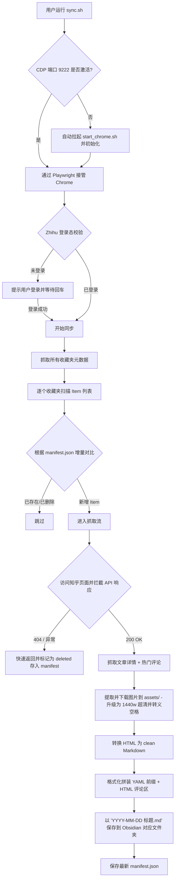

# 知乎收藏夹 → Obsidian 本地知识库 Pipeline

本项目是一个将知乎收藏夹中的**回答和专栏文章**全自动拉取并深度本地化为 Obsidian 笔记的增量同步系统。系统能够自动绕过反爬机制、本地化保存所有高清图片、格式化热门评论、并以极其整洁的排版归档进您的 Obsidian 库中。

---

## 🌟 核心特性

- **🚀 一键全自动交互**：运行 `./sync.sh` 会自动拉起 Debug 模式的 Chrome。若检测到未登录，会引导您在浏览器中登录并在您回车确认后自动跑完全部流程；若已登录，则全程静默同步。
- **🛡️ 零反爬封号风险**：采用 Playwright CDP 连接真实 Chrome 浏览器，利用您在浏览器中的真实登录态，免除携带复杂 Cookie 和逆向签名的烦恼。
- **📸 完美图片本地化**：
  - 自动将远程 `zhimg.com` 图片链接升级为 `_1440w` 的**超清大图版本**下载到本地。
  - 路径生成自动进行 **URL 编码转义**（例如将空格转换为 `%20`），彻底解决 Obsidian 内因路径包含空格而裂图的问题。
  - 存放于库根目录下的 `assets/` 文件夹中，笔记内部使用相对路径 `../../assets/` 引用，符合 Obsidian 最佳实践。
- **💬 完美 HTML 折叠评论**：通过在浏览器执行异步 Fetch 的方式，在宿主域下安全绕过签名拉取前 20 条热门评论。评论采用原生 HTML (`<details>`、`<strong>`、`<br>`、`<hr>`) 语法排版，在 Obsidian 的 Live Preview 中渲染精美且排版清晰。
- **📅 创作时间归档命名**：文件名自动以文章或回答的**创作发表日期**（`YYYY-MM-DD`）作为前缀，方便按时间轴归档（例如：`2026-06-29 OpenCode到底什么水平？.md`）。
- **⚡ 智能增量更新 & 失效过滤**：
  - 使用 `manifest.json` 记录同步历史，仅对新增内容进行同步。
  - **404 智能快退**：如果某篇文章在知乎上已被原作者删除，系统会在 0.1 秒内识别 404 状态并快速退出，同时在 `manifest.json` 中标记为 `deleted` 状态。后续同步时会直接跳过，彻底避免重复请求无效链接。

---

## 🏗️ 系统架构设计



### 核心模块说明：
1. **[auth.py](src/zhihu_pipeline/auth.py)**: 基于真实 DOM 检测（如用户头像、登录按钮）判定登录状态，管理 CDP 调试端口生命周期。
2. **[fetcher.py](src/zhihu_pipeline/fetcher.py)**: 精准拦截 XHR 响应与 DOM 备用提取双通道设计。针对知乎**专栏文章 (`zhuanlan.zhihu.com/p/...`)** 和**回答 (`www.zhihu.com/question/...`)** 使用不同的解析路由，并提供 404 极速识别。
3. **[parser.py](src/zhihu_pipeline/parser.py)**: 使用 BeautifulSoup 去除知乎的浮动栏、热搜、赞同推荐等噪声 HTML，将其干净地转换为标准的 Markdown。
4. **[images.py](src/zhihu_pipeline/images.py)**: 图片下载与路径改写核心。通过 HTTP 客户端模拟浏览器 Referer，拉取图片，并进行 URL 编码化处理。
5. **[comments.py](src/zhihu_pipeline/comments.py)**: 提取热门评论，使用纯 HTML 标签排版以防止 Markdown 块引起的 Obsidian 渲染器塌陷。
6. **[storage.py](src/zhihu_pipeline/storage.py)**: 负责 Markdown YAML Front Matter 生成、去重机制以及本地 `manifest.json` 数据库维护。

---

## 🛠️ 安装与配置

### 1. 依赖安装与配置准备
推荐使用现代 Python 包管理器 `uv`（也可以直接使用 `pip`）：
```bash
# 克隆并安装依赖
uv sync

# 复制配置文件模板
cp config.example.yaml config.yaml
```

### 2. 配置文件 `config.yaml`
在项目根目录的 `config.yaml` 中配置您的 Obsidian 库路径以及需要同步的收藏夹。
```yaml
storage:
  # 您的 Obsidian 库根路径（支持 ~ 符号扩展）
  obsidian_path: "~/notes"

chrome:
  debug_port: 9222
  # 本地 Chrome 执行路径（用于一键唤醒浏览器）
  executable_path: "/Applications/Google Chrome.app/Contents/MacOS/Google Chrome"

sync:
  # 开启增量同步
  incremental: true
  # 是否拉取评论
  include_comments: true
  max_comments: 20
  # 需要同步的收藏夹名称列表（若为空，默认同步您账号下的所有收藏夹）
  collections:
    - "Garage"
    - "Hack"
    - "我的收藏"
```

---

## 🚀 运行指南

### 快捷命令

- **全量同步**（自动同步 `config.yaml` 配置的收藏夹或全量收藏夹）：
  ```bash
  ./sync.sh
  ```
- **同步指定收藏夹**（通过命令行覆盖配置，仅同步指定收藏夹）：
  ```bash
  ./sync.sh --collection "Garage"
  ```
- **强制重新同步**（无视 `manifest.json` 状态，强行重新拉取覆盖）：
  ```bash
  ./sync.sh --full
  ```

---

## 📂 生成的目录结构

同步完成后，在您的 Obsidian 库（如 `~/notes`）下会生成如下结构：
```text
~/notes/
├── assets/                          # 统一的高清图片文件夹
│   └── 仅一个文件，暴涨了 34000+ GitHub Star！/
│       ├── file-20260713163705692.jpg
│       └── file-20260713163705693.jpg
└── 知乎收藏/                         # 笔记输出归档目录
    ├── Hack/                        # 以收藏夹名称作为分类文件夹
    │   ├── 2025-04-18 为什么Git的教程都那么繁杂？.md
    │   ├── 2026-07-13 仅一个文件，暴涨了 34000+ GitHub Star！.md
    │   └── 2019-12-08 手把手教 如何模拟IC加密卡.md
    ├── Garage/
    │   └── 2020-05-10 地下车位有产权吗？.md
    └── manifest.json                # 增量比对状态数据库
```

---

## 📝 单元测试

本项目包含完善的解析器及各个流程的单元测试，您可以运行以下命令进行校验：
```bash
PYTHONPATH=src pytest
```
