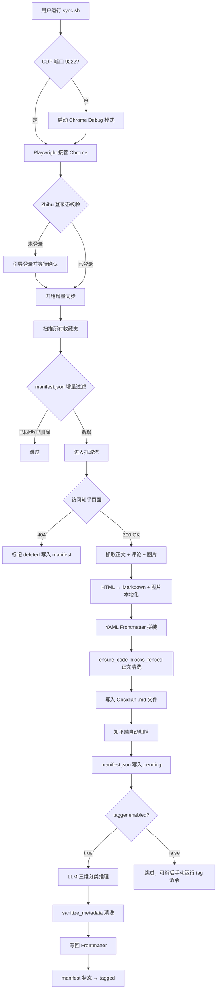

# 知乎收藏夹 → Obsidian 本地知识库 Pipeline

一个将知乎收藏夹中的**回答和专栏文章**全自动拉取、深度本地化，并通过本地大模型进行**三维知识标签分类**的增量同步系统。最终输出**可被 Obsidian Dataview 动态查询的结构化知识库**。

---

## 💡 为什么需要这个工具？

### 1. 从"碎片收藏"到"系统知识"
在地铁或午休时刷到优质专栏和回答，随手一收藏——但收藏夹里堆了几百篇文章，却从未再被打开过。这是所有重度知乎用户的通病。本工具把这个"收藏即遗忘"的黑洞，改造成**自动运转的知识入库流水线**：

- 📱 **知乎收藏夹** = 你的"收件箱（Inbox）"
- 🖥️ **Obsidian 本地库** = 你的"知识资产数据库"
- 🤖 **本地大模型** = 自动帮你打标签的智能分类员

### 2. 解决三个核心痛点

| 痛点 | 传统方式 | 本工具方案 |
|---|---|---|
| 文章失效 | 回来发现 404 | 全文本地化，永久保存 |
| 归类选择焦虑 | 一篇文章只能放一个文件夹 | 多维标签，一篇文章同时属于多个领域 |
| 标签混乱 | 手动打标随意且不一致 | 三层 Guardrail 确保标签格式统一 |

### 3. 闭环工作流

```
收藏 (手机/网页) → 同步 (./sync.sh) → 自动打标 (本地 LLM) → 归档入库 (Obsidian)
                                          ↑
                         知乎网页端自动移入 archive 收藏夹，收件箱保持清空
```

---

## 🌟 核心特性

### 抓取与归档
- **🚀 一键全自动**：运行 `./sync.sh` 会自动连接 Chrome。未登录时引导登录，已登录则全程静默同步。
- **🛡️ 零反爬封号风险**：Playwright CDP 接管真实 Chrome，使用您自己的登录态，无需逆向签名或 Cookie 破解。
- **📸 图片完美本地化**：自动升级为 `_1440w` 超清版本下载、URL 编码路径（解决 Obsidian 空格裂图）、存入统一 `assets/` 目录。
- **💬 热门评论折叠**：前 20 条热门评论以原生 HTML `<details>` 标签折叠，在 Obsidian Live Preview 中渲染精美。
- **⚡ 智能增量同步**：`manifest.json` 记录同步历史，404 文章 0.1 秒内快退并标记 `deleted`，永不重复请求。
- **🗂️ 自动线上归档**：同步成功后自动将文章从主收藏夹移入私密 `archive` 收藏夹，主收藏夹始终保持清空。

### 🤖 本地大模型自动标签系统（新功能）

这是本项目的核心差异化功能。每篇文章入库后，通过本地运行的 **LM Studio + Gemma4-12B** 进行三维元数据推理：

| 维度 | 说明 | 示例 |
|---|---|---|
| `domain` | 宏观知识领域（1-3个）| `AI`, `Engineering`, `Finance` |
| `concept` | 核心技术概念/工具（2-5个）| `RAG`, `vibe-coding`, `prompt-engineering` |
| `level` | 文章知识深度 | `beginner` / `intermediate` / `advanced` |
| `summary` | 中文一句话摘要 | *"本文通过实例讲解了稀疏向量在 RAG 系统中的工业落地方案。"* |

生成的 Obsidian Frontmatter 示例：

```yaml
---
title: 【硬核干货】扔掉BM25，拥抱稀疏向量
source: https://zhuanlan.zhihu.com/p/...
author:
- '[[作者名]]'
tags:
- zhihu
domain:
- AI
- Engineering
concept:
- RAG
- BM25
- sparse-vector
- BGE-M3
- hybrid-search
level: intermediate
summary: 本文对比 BM25 与稀疏向量，阐述后者在语义匹配和增量更新上的优势及工业级落地方案。
---
```

#### 三层标签质量防御机制

打标签结果经过三层 Guardrail 过滤，确保格式永久一致、不产生垃圾标签：

```
LLM 原始输出
    │
    ▼
Layer 1: System Prompt 强约束
         (缩写词全大写 / 专有名词驼峰 / 通用概念 kebab-case / 禁止垃圾词)
    │
    ▼
Layer 2: Python 后处理清洗器 sanitize_metadata()
         (ACRONYMS 字典 / PROPER_NOUNS 字典 / BLACKLIST / 去引号去重)
    │
    ▼
Layer 3: 代码块围栏防御 ensure_code_blocks_fenced()
         (防止裸 Python '#' 注释被 Obsidian 误解析为标签)
    │
    ▼
写入 Markdown 文件
```

#### 断点续打，天然幂等

打标签与下载**完全解耦**。通过 `manifest.json` 记录每篇文章的打标状态（`pending / tagged / failed / skipped`）：
- 中途超时或失败的文章下次运行时会**自动重试**
- 已成功打标的文章不会被重复调用 LLM
- 可随时用独立命令补打历史文章

---

## 🏗️ 系统架构



### 核心模块

| 模块 | 职责 |
|---|---|
| [auth.py](src/zhihu_pipeline/auth.py) | CDP 端口管理、登录态检测 |
| [fetcher.py](src/zhihu_pipeline/fetcher.py) | XHR 拦截 + DOM 双通道抓取，专栏/回答分路由，404 极速识别 |
| [parser.py](src/zhihu_pipeline/parser.py) | BeautifulSoup 噪声清洗，HTML → clean Markdown |
| [images.py](src/zhihu_pipeline/images.py) | 超清图片下载、URL 编码路径改写 |
| [comments.py](src/zhihu_pipeline/comments.py) | 热门评论提取，HTML `<details>` 折叠排版 |
| [storage.py](src/zhihu_pipeline/storage.py) | Frontmatter 生成、manifest.json 维护、代码块防御 |
| [archiver.py](src/zhihu_pipeline/archiver.py) | 知乎端自动归档弹窗操作 |
| [tagger.py](src/zhihu_pipeline/tagger.py) | LLM 三维分类推理、三层 Guardrail 清洗、断点重试调度 |

---

## 🛠️ 安装与配置

### 1. 前置依赖

- Python 3.11+
- [uv](https://docs.astral.sh/uv/) 包管理器
- Google Chrome（系统已安装即可）
- [LM Studio](https://lmstudio.ai/)（仅在启用自动打标签时需要）

```bash
# 克隆并安装依赖
git clone https://github.com/hardass/ZhihuPipeline.git
cd ZhihuPipeline
uv sync

# 复制配置模板
cp config.example.yaml config.yaml
```

### 2. 配置文件 `config.yaml`

```yaml
# Chrome 连接
chrome:
  debug_port: 9222

# 同步设置
sync:
  collections: "all"              # "all" 或指定收藏夹名列表，如 ["默认收藏夹", "Hack"]
  include_comments: true          # 是否获取热门评论
  max_comments: 20
  delay_min: 3                    # 请求间隔（秒），建议不低于 3
  delay_max: 8
  auto_archive: true              # 同步成功后自动移入 archive 收藏夹
  archive_name: "archive"

# Obsidian 输出
output:
  vault_path: "~/notes"           # 你的 Obsidian 库根目录（支持 ~ 扩展）
  collection_dir: "知乎收藏"
  image_naming: "file-${date:YYYYMMDDHHmmssSSS}"

# 自动打标签（需要本地 LM Studio 运行）
tagger:
  enabled: true                   # false = 只下载，不打标签
  backend: "local"
  lm_studio_url: "http://localhost:1234"
  model: "gemma4-12b-qat-uncensored-hauhaucs-balanced"   # 或任意已加载的模型 ID
  timeout: 600                    # 单篇推理超时（秒），Gemma4-12B 建议 600
```

---

## 🚀 运行指南

### 同步收藏夹

```bash
# 全量同步（自动打标签，如 tagger.enabled=true）
./sync.sh

# 仅同步指定收藏夹
./sync.sh --collection "Hack"

# 强制重新拉取所有内容（忽略 manifest）
./sync.sh --full
```

### 独立打标签命令

打标签与下载完全解耦，可随时单独运行：

```bash
# 对所有 pending/failed 的文章进行打标（自动重试上次失败的）
uv run -m zhihu_pipeline tag

# 预览将要打标的文章，不实际调用 LLM
uv run -m zhihu_pipeline tag --dry-run

# 强制对所有文章重新打标（包括已成功的）
uv run -m zhihu_pipeline tag --force
```

---

## 📂 输出目录结构

```text
~/notes/
├── assets/                              # 所有高清图片统一目录
│   └── 扔掉BM25，拥抱稀疏向量/
│       ├── file-20260302134512001.jpg
│       └── file-20260302134512002.jpg
└── 知乎收藏/
    ├── 归档/                            # 扁平归档，auto_archive 后的所有文章
    │   ├── 2026-03-02 【硬核干货】扔掉BM25，拥抱稀疏向量.md
    │   ├── 2026-06-29 量化交易的本质完完全全就是统计学吗？.md
    │   └── ...（250+ 篇，Dataview 动态查询）
    └── manifest.json                    # 增量同步 + 打标状态数据库
```

每篇文章均是结构化的 Obsidian Markdown，包含 YAML Frontmatter（带 domain/concept/level/summary）、原文正文、本地图片引用，以及折叠的热门评论区。

---

## 📝 单元测试

```bash
uv run pytest tests/ -v
```

目前覆盖 25 项测试，包括解析器、存储层、打标签三层 Guardrail（sanitize_term / sanitize_metadata / ensure_code_blocks_fenced）及 manifest 状态机。

---

## ⚠️ 注意事项

- 本工具仅供个人学习与知识管理使用，请勿用于商业抓取或大规模爬取。
- 建议 `delay_min` 不低于 3 秒，减少对知乎服务器的请求压力。
- 自动打标签功能依赖本地运行的 LM Studio，LLM 推理耗时受本机硬件影响（Gemma4-12B 单篇约 2-8 分钟，建议在不使用电脑时后台运行）。
