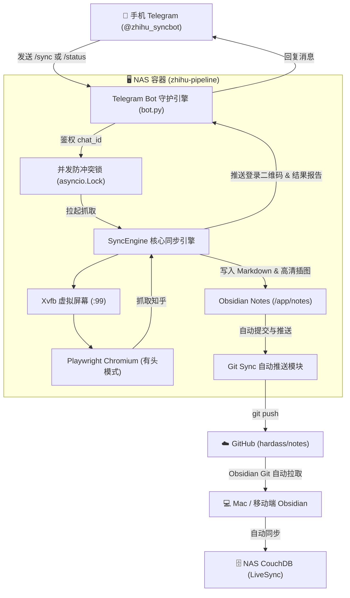

# 知乎收藏夹 → Obsidian 本地知识库 Pipeline (Telegram Bot & Docker 强化版)

一个将知乎收藏夹中的**回答和专栏文章**全自动拉取、深度本地化，并通过本地大模型进行**三维知识标签分类**的增量同步系统。支持 **Telegram 机器人交互触发**、**二维码自动扫码接力** 及 **Docker 容器化无人值守部署（支持 QNAP NAS / Linux VPS）**。

最终输出**可被 Obsidian Dataview 动态查询的结构化知识库**。

---

## 💡 为什么需要这个工具？

### 1. 从"碎片收藏"到"系统知识"
在地铁或午休时刷到优质专栏和回答，随手一收藏——但收藏夹里堆了几百篇文章，却从未再被打开过。本工具把"收藏即遗忘"的黑洞，改造成**自动运转的知识入库流水线**：

- 📱 **知乎收藏夹** = 你的“收件箱（Inbox）”
- 🤖 **Telegram 机器人** = 你的手机“远程遥控器”，随时发送 `/sync` 触发抓取
- 🖥️ **Obsidian 本地库** = 你的“知识资产数据库”
- 🧠 **本地大模型** = 自动帮你打标签的智能分类员

### 2. 核心特性矩阵

| 特性 | 详情说明 |
|---|---|
| 🌐 **GitHub 自动双向推送** | 抓取落盘后自动 `git add & commit & push` 到 GitHub 笔记库，跨设备 Obsidian 无缝拉取 |
| 🤖 **Telegram 守护模式** | 容器常驻后台，在手机 Telegram 发送 `/sync` 即可随时拉起同步，发送 `/status` 查看统计 |
| 📲 **二维码自动接力** | 登录失效时，后台自动截取登录二维码推送到 Telegram，手机知乎扫码后自动继续同步 |
| 🛡️ **无感反爬与有头虚拟屏** | 内置 Xvfb 虚拟屏幕渲染，Playwright 以有头模式在内存中运行，彻底规避知乎无头浏览器风控 |
| 📸 **高清图片全本地化** | 自动升级为 `_1440w` 超清图片下载、URL 编码路径（防 Obsidian 空格裂图）、存入统一 `assets/` |
| 💬 **热门评论折叠排版** | 前 20 条热门评论以原生 HTML `<details>` 标签折叠，在 Obsidian 中渲染精美 |
| ⚡ **增量同步与快速退避** | `manifest.json` 记录同步历史，404 文章 0.1 秒快退标记，绝不重复请求 |
| 🏷️ **AI 三维标签系统** | 接入本地 LLM (如 LM Studio / Qwen2.5) 提取 `domain`、`concept`、`level`、`summary` |

---

## 📱 Telegram 机器人交互指令

在 Telegram 中向您的机器人发送以下指令即可完成全部日常运维：

| 指令 | 作用说明 |
|---|---|
| `/sync` | 立即触发一次知乎收藏同步。若未登录则推送登录二维码，同步完成后自动 Push 到 GitHub 并回复统计报告 |
| `/status` | 查看系统运行状态、已同步文章总数、各分类篇数、待打标队列与上次同步时间 |
| `/help` 或 `/start` | 显示帮助菜单与指令列表 |

---

## 🏗️ 架构概览


```mermaid
flowchart TD
    User["📱 手机 Telegram (@zhihu_syncbot)"]
    
    subgraph Host ["🖥️ NAS 容器 (zhihu-pipeline)"]
        Bot["Telegram Bot 守护引擎 (bot.py)"]
        Lock["并发防冲突锁 (asyncio.Lock)"]
        Engine["SyncEngine 核心同步引擎"]
        Xvfb["Xvfb 虚拟屏幕 (:99)"]
        Playwright["Playwright Chromium (有头模式)"]
        Vault["Obsidian Notes (/app/notes)"]
        Git["Git Sync 自动推送模块"]
    end

    GitHub["☁️ GitHub (hardass/notes)"]
    Obsidian["💻 Mac / 移动端 Obsidian"]
    CouchDB["🗄️ NAS CouchDB (LiveSync)"]
    
    User -->|发送 /sync 或 /status| Bot
    Bot -->|鉴权 chat_id| Lock
    Lock -->|拉起抓取| Engine
    Engine --> Xvfb
    Xvfb --> Playwright
    Playwright -->|抓取知乎| Engine
    Engine -->|写入 Markdown & 高清插图| Vault
    Vault -->|自动提交与推送| Git
    Git -->|git push| GitHub
    GitHub -->|Obsidian Git 自动拉取| Obsidian
    Obsidian -->|自动同步| CouchDB
    Engine -->|推送登录二维码 & 结果报告| Bot
    Bot -->|回复消息| User
```

---

## ⚙️ 配置文件 `config.yaml`

```yaml
# Chrome Profile & Browser
chrome:
  user_data_dir: "~/.zhihu_pipeline/chrome_profile"  # 浏览器会话与 Cookie 持久化目录
  headless: false                                    # 保持 false，配合 Xvfb 运行

# Telegram Bot (用于二维码推送与指令交互)
telegram:
  enabled: true
  bot_token: "YOUR_TELEGRAM_BOT_TOKEN"               # 从 @BotFather 获取
  chat_id: "YOUR_TELEGRAM_CHAT_ID"                   # 您的 Telegram 用户 ID
  timeout: 300                                       # 扫码等待超时时间 (秒)

# GitHub 自动双向同步
git:
  enabled: true                                      # 开启后每次同步自动 pull/push 到 GitHub
  repo_url: "https://<USER>:<TOKEN>@github.com/hardass/notes.git"
  branch: "main"
  user_name: "hardass"
  user_email: "hardas.yang@gmail.com"
  auto_pull: true
  auto_push: true

# Sync Settings
sync:
  collections: "all"                                 # "all" 或指定收藏夹名称列表 ["我的收藏", "技术"]
  include_comments: true                             # 是否抓取前 20 条热门评论
  max_comments: 20
  delay_min: 3                                       # 请求间隔延时 (秒)，防风控
  delay_max: 8
  remove_after_sync: true                            # 抓取成功后自动从知乎收藏夹移除 (Inbox 消费模式)

# Obsidian Output
output:
  vault_path: "~/notes"                              # Obsidian 笔记库根目录
  collection_dir: "知乎收藏"
  image_naming: "file-${date:YYYYMMDDHHmmssSSS}"

# Auto-tagging (可选，接入本地大模型)
tagger:
  enabled: false                                     # true 开启自动打标签
  backend: "local"
  lm_studio_url: "http://localhost:1234"
  model: "qwen2.5-3b-instruct-mlx"
```

---

## 🚀 部署与运行指南

### 方式 A：Docker 常驻部署（推荐用于 QNAP NAS / 软路由 / Linux VPS）

1. **准备配置文件**：
   ```bash
   cp config.example.yaml config.yaml
   # 填入您的 telegram.bot_token 和 telegram.chat_id
   ```

2. **启动常驻 Telegram Bot 容器**：
   ```bash
   docker compose up -d --build
   ```
   > 容器将开机自启并常驻后台。您可以在手机 Telegram 中发送 `/sync` 随时启动抓取！

3. **常用 Docker 运维命令**：
   ```bash
   # 查看实时日志
   docker compose logs -f
   
   # 单次执行手动同步 (非常驻模式)
   docker compose run --rm zhihu-pipeline sync
   
   # 检查登录状态
   docker compose run --rm zhihu-pipeline check-auth
   ```

---

### 方式 B：本地直接运行 (macOS / Linux)

1. **安装依赖**：
   ```bash
   git clone https://github.com/hardass/ZhihuPipeline.git
   cd ZhihuPipeline
   uv sync
   uv run playwright install chromium
   ```

2. **常用指令**：
   ```bash
   # 启动 Telegram 交互式机器人
   uv run python -m zhihu_pipeline bot
   
   # 单次全量同步
   uv run python -m zhihu_pipeline sync
   
   # 检查知乎登录态
   uv run python -m zhihu_pipeline check-auth
   
   # 独立运行未打标文章的 AI 分类打标
   uv run python -m zhihu_pipeline tag
   ```

---

## 📂 输出目录结构

```text
~/notes/
├── assets/                              # 所有高清图片统一本地存储
│   └── 扔掉BM25，拥抱稀疏向量/
│       ├── file-20260302134512001.jpg
│       └── file-20260302134512002.jpg
└── 知乎收藏/
    ├── 我的收藏/                        # 按收藏夹分类存储的 Markdown 文件
    │   ├── 2026-03-02 【硬核干货】扔掉BM25，拥抱稀疏向量.md
    │   ├── 2026-06-29 量化交易的本质完完全全就是统计学吗？.md
    │   └── ...
    └── manifest.json                    # 增量同步数据库与打标状态
```

---

## 📝 单元测试

```bash
PYTHONPATH=src pytest -v
```
涵盖 Telegram 消息/图片 Mock 推送、扫码登录流、DOM 登录识别、HTML 清洗与 Markdown 转换、AI 标签清洗 Guardrail、Telegram Bot 指令路由及 GitHub 自动双向同步测试（37 项测试用例 100% 通过）。
